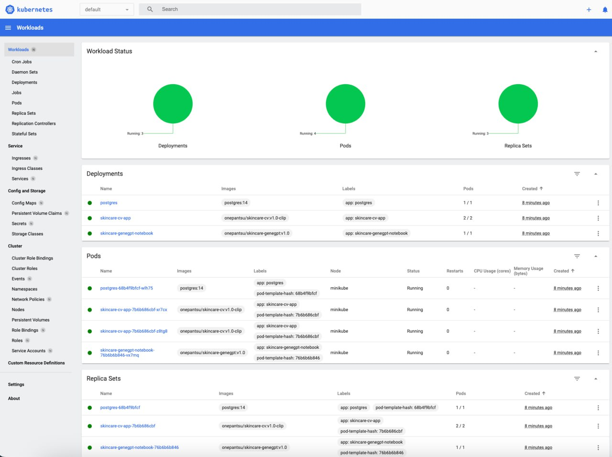
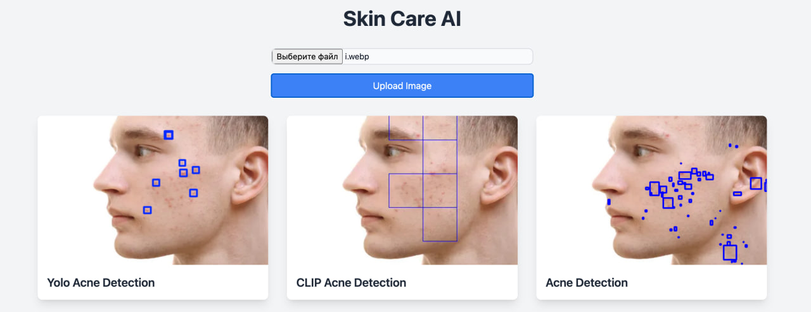

# skin-care-ai

## 📖 Описание
Проект представляет собой приложение по уходу за кожей с использованием ИИ. Сервер обрабатывает изображения лиц, 
увеличивая контрастность и выделяя области с акне, прыщами, покраснениями и неровным тоном кожи. 
Пользователи могут загружать свои фотографии, а в ответ получат несколько изображений с обозначенными областями интереса.

## ⭐️ Запуск приложения
### Запуск приложения через Docker:
1. **Build**:
    ```bash
    make docker-build MODEL=yolo
    ```
    Аргумент MODEL может принимать значения в соответствии с названиями моделей:
    - `yolo`
    - `clip`
   
2. **Run**:
    ```bash
    make docker-run PORT=8000
    ```
   
### Запуск через docker-compose:
Необходимо создать `.env`-файл по примеру (`.env-sample`)
Затем запустить docker-compose:
```bash
make compose-run
```
Для ограничения ресурсов конкретного сервиса можно использовать `deploy.resources.limits` и `deploy.resources.reservations`

Для запуска конкретного сервиса воспользуйтесь командой (вместо `detection-db` указывается называние сервиса):
```bash
docker-compose up detection-db
```
 
### Запуск через minikube:
В директории `k8s/` представлены манифесты для деплоймента:
- **PostgreSQL** в качестве 1 реплики
- **ScinCare CV**, использующее модель `CLIP`, в качестве 2 реплик с запуском init-контейнера для миграций в БД
- **ScinCare GeneGPT** в качестве 1 реплики

Скрипт `k8s/minikube-up.sh` позволяет запустить minikube и создать манифесты в правильном порядке.

Запуск скрипта `k8s/minikube-up.sh` можно провести с помощью команды:
```bash
make minikube-run
```
После запуска дашборд (`minikube dashboard --url`) должен выглядеть следующим образом:


## 🖼️ Интерфейс приложения SkinCare CV

