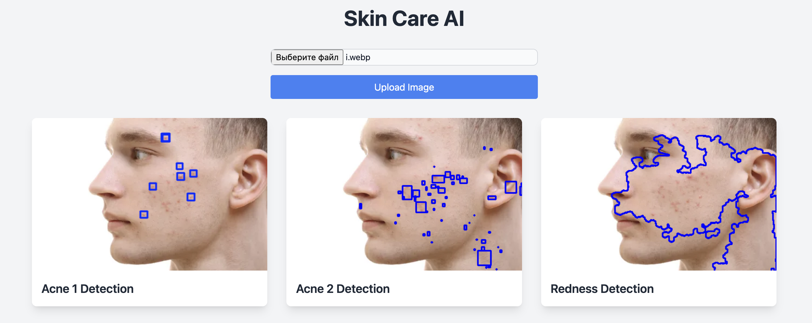

# skin-care-ai

## 📖 Описание
Проект представляет собой приложение по уходу за кожей с использованием ИИ. Сервер обрабатывает изображения лиц, 
увеличивая контрастность и выделяя области с акне, прыщами, покраснениями и неровным тоном кожи. 
Пользователи могут загружать свои фотографии, а в ответ получат несколько изображений с обозначенными областями интереса.

## ⭐️ Запуск приложения

Запустите приложение через докер:
```bash
docker-compose build
docker-compose up
```
Или через утилиту make:
```bash
make docker-run
```
## 🖼️ Пример работы приложения

