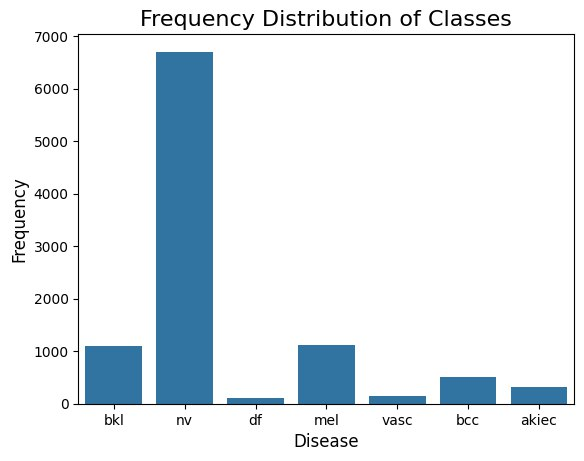
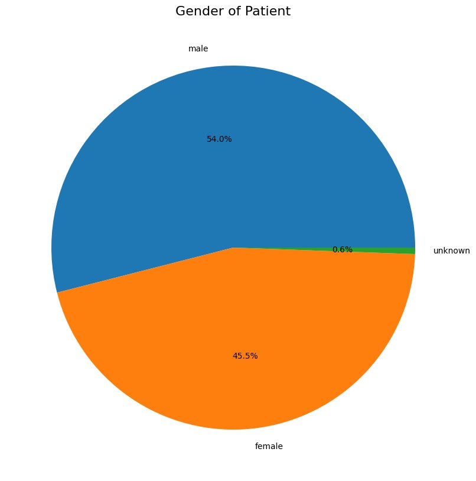
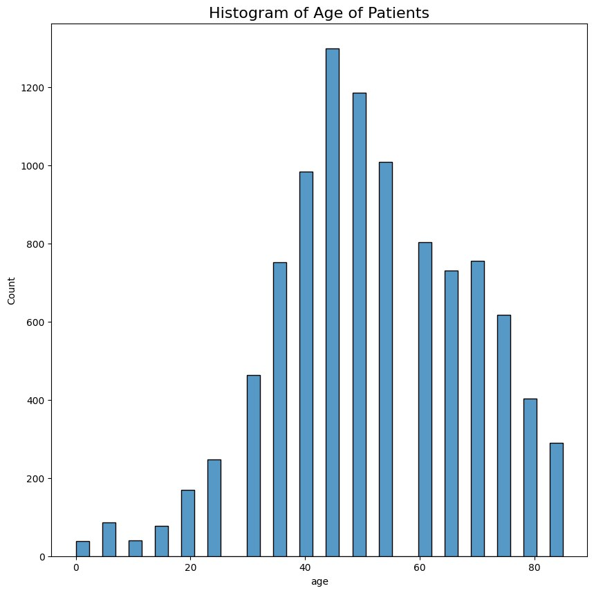
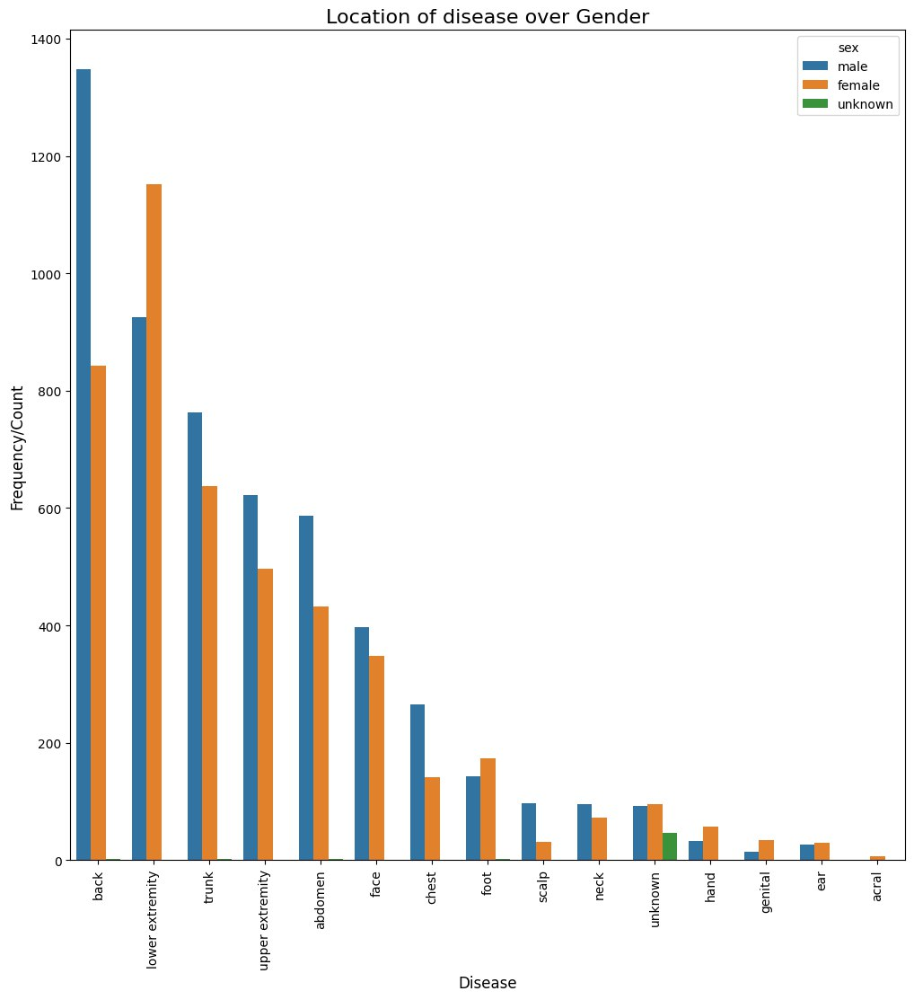

# EDA

## Данные

Данные, которые были использованы для обучения модели - Skin Cancer MNIST: HAM10000
Данный датасет представляет собой большую коллекцию дерматоскопических изображений пигментных поражений из разных источников.
Набор данных состоит из 10015 дерматоскопических изображений, которые могут служить обучающим набором для машинного обучения. Случаи включают репрезентативную коллекцию всех важных диагностических категорий в области пигментных поражений: Актинический кератоз и интраэпителиальная карцинома / болезнь Боуэна (akiec), базально-клеточная карцинома (bcc), доброкачественные кератозоподобные поражения (солнечные лентигины / себорейные кератозы и лихено-плановые кератозы, bkl), дерматофиброма (df), меланома (mel), меланоцитарный невус (nv) и сосудистые поражения (ангиомы, ангиокератомы, пиогенные гранулемы и кровоизлияния, vasc).

Каждая запись датасета содержит следующую информацию:
lesion_id, image_id
dx: akiec | bcc | nv | mel | bkl | df | vasc
dx_type: histo | follow_up | consensus | confocal
age: 0-85
sex: male | female
localization: back | lower extremity | scalp | ear | face etc.

## Исследовательский анализ данных

[//]: # (![code]&#40;eda_code.jpg&#41;)

1. Частота классов - Frequency of Classes

   

2. Распределение кожных заболеваний по полу - Distribution of Skin disease over Gender

   

3. Гистограмма возраста пациентов - Histogram of the age of patients

   

4. Расположение заболевания в зависимости от пола - Location of disease over Gender

   
