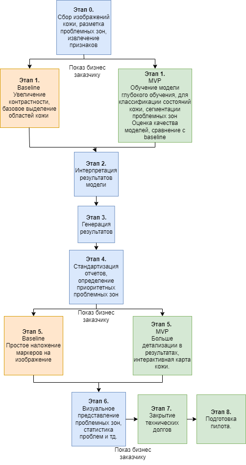

# ML System Design Doc 

# 1. Цели и предпосылки

## 1.1. Зачем идем в разработку продукта?
### Бизнес-цель: 
Разработать сервис для первичного анализа состояния кожи, с использованием ИИ. Приложение направлено на то, чтобы помочь пользователям лучше понять состояние своей кожи, предоставляя персонализированный анализ кожи с подсвечиванием проблемных зон на загруженных фотографиях лица 
### Почему станет лучше, чем сейчас, от использования ML: 
В настоящее время пользователи часто полагаются на общие советы по уходу за кожей, которые могут быть не оптимальными для их индивидуальных потребностей. Используя методы машинного обучения, приложение поможет пользователям быстро и незатруднительно получить более точный и персонализированный анализ состояния кожи, выявляя проблемы, например, угри, покраснение и неровный тон кожи. Это позволит пользователю понять проблемы и потребности собственной кожи и персонализировать уход
### Что будем считать успехом итерации с точки зрения бизнеса: 
- Точное определение дефектов кожи на загруженном изображении - измеряемое путем проверки на соответствие оценкам дерматологов.
- Вовлеченность и удовлетворенность пользователей - обратная связь, отзывы и тд.

## 1.2. Бизнес-требования и ограничения

### Краткое описание БТ и ссылки на детальные документы с бизнес-требованиями:
 - Загрузка изображения лица пользователем, 
 - Обработка изображения с использованием ML-моделей, 
 - Увеличение контрастности проблемных зон, 
 - Выделение областей с кожными проблемами (акне, покраснения, неровный тон), 
 - Возврат размеченных изображений пользователю
 -  Обеспечение высокой точности и надежности анализа состояния кожи

### Бизнес-ограничения:
- Строгие требования к защите данных и конфиденциальности
- Поддержка основных форматов изображений (JPEG, PNG)
- Масштабируемость системы
- Быстрая обработка изображений (не более 3-5 секунд)
- Жесткие сроки для запуска начальной версии приложения из-за конкурентного давления (январь 2025-го)

### Что мы ожидаем от конкретной итерации:
- Разработка функционального прототипа, который сможет точно обнаруживать и выделять основные проблемы кожи на загруженных фотографиях
- Проверка точности и полезности приложения с помощью тестирования пользователями и сбора обратной связи
- Заложить техническую основу для будущих итераций.

### Описание бизнес-процесса пилота, насколько это возможно:
1. Пользователь загружает фотографию лица в приложение
2. Приложение анализирует фотографию и определяет любые проблемы или подозрения на проблемы с кожей
3. Пользователи предоставляют отзывы о точности анализа и полезности рекомендаций
4. Команда приложения собирает и анализирует отзывы пользователей, чтобы улучшить модель и рекомендации для будущих версий

### Что считаем успешным пилотом? Критерии успеха и возможные пути развития проекта:
- Доля положительных отзывов пользователей > 80%
- Точность детекции > 80%
- Время обработки < 5 секунд
- Удобство использования (SUS > 75 %)
- Стабильность работы системы (Uptime > 90 %)

###  Возможные пути развития проекта: 
- Улучшить возможности анализа кожи для обнаружения более широкого спектра проблем
- Создать систему рекомендаций по уходу за кожей для обеспечения более персонализированных и динамических советов
- Изучить возможность интеграции с платформами - каталогами продуктов для ухода за кожей
- Изучить возможность интеграции с сервисами, предоставляющими дистанционные консультации с врачами-дерматологами и т.п.
- Разработать мобильные приложения и другие формы для улучшения пользовательского опыта

## 1.3. Что входит в скоуп проекта/итерации, что не входит

### На закрытие каких БТ подписываемся в данной итерации: 
- Разработка MVP с детекцией акне и кожных дефектов по фото
- Многомодельное решение (YOLO, CLIP) 
- Обеспечение интуитивно понятного пользовательского интерфейса для загрузки фотографий и просмотра результатов анализа

### Что не будет закрыто (в данной итерации): 
- Возможность отслеживать улучшение состояния кожи со временем
- Разработка мобильного приложения
- Полноценная медицинская диагностика
- Рекомендации по уходу 

### Описание результата с точки зрения качества кода и воспроизводимости решения: 
- Модульная и масштабируемая архитектура
- Comprehensive automated testing suite to ensure reliability and regression testing
- Четкая документация и шаблоны проектирования (для облегчения дальнейшей разработки и адаптации новых членов команды)
- Deployment pipeline, поддержка CI/CD

### Описание планируемого технического долга (что оставляем для дальнейшей продуктивизации): 
- Расширенная аналитика и рекомендации по уходу
- Расширенный набор возможностей по обнаружению состояния кожи

## 1.4. Предпосылки решения

### Описание всех общих предпосылок решения, используемых в системе – с обоснованием от запроса бизнеса: какие блоки данных используем, горизонт прогноза, гранулярность модели, и др.

- Рост интереса к персонализированным медицинским решениям
- Развитие технологий компьютерного зрения
- Доступность ML-библиотек для детекции объектов

Какие блоки данных:
- Мы будем использовать набор данных фотографий лиц, помеченных различными состояниями и проблемами кожи, полученных из авторитетных дерматологических источников.

Горизонт прогноза:
- Анализ состояния кожи, предоставляемые приложением, будут основываться на текущем состоянии кожи пользователя по одной фотографии, без долгосрочного прогнозирования

- Целевая точность моделей обнаружения состояния кожи - достижение не менее 90% точности и полноты, подтвержденных оценками дерматологов.

# 2. Методология

## 2.1. Постановка задачи

1. Анализ изображений:
   - Внедрение моделей компьютерного зрения для обнаружения и локализации различных состояний кожи (например, акне, покраснение, неровный тон кожи) на загруженных изображениях лица.
   - Использование таких методов, как сверточные нейронные сети и алгоритмы сегментации, для достижения точного обнаружения на уровне пикселей.
2. Пользовательский интерфейс:
   - Разработка интуитивно понятного пользовательского интерфейса, который позволяет пользователям легко загружать фотографии, просматривать результаты анализа кожи и получать доступ к рекомендуемым продуктам.
   - Включение визуально привлекательных визуализаций для выделения обнаруженных проблем с кожей и предоставления четких указаний по рекомендуемым действиям.
3. Внутренняя инфраструктура:
   - Создание масштабируемой внутренней системы для обработки запросов пользователей, обработки изображений и обслуживания результатов анализа кожи и рекомендаций.

## 2.2 Блок-схема решения

