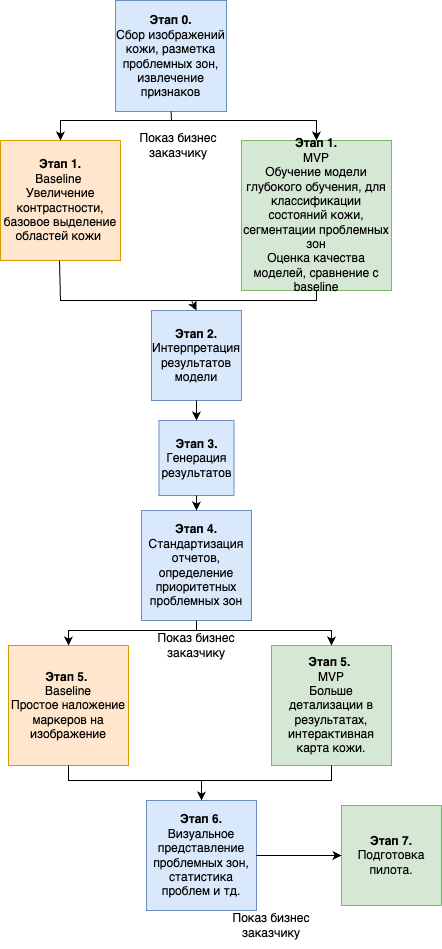
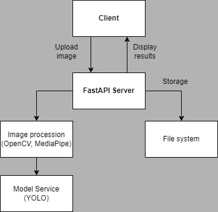

# ML System Design Doc 

# 1. Цели и предпосылки

## 1.1. Зачем идем в разработку продукта?
### Бизнес-цель: 
Разработать сервис для ранней детекции и классификации рака кожи, с использованием ИИ. Приложение направлено на помощь пользователям и медицинским специалистам в выявлении подозрительных новообразований кожи путем автоматического анализа изображений потенциально проблемных участков кожи.
### Почему станет лучше, чем сейчас, от использования ML: 
Зачастую диагностика рака кожи происходит на поздних стадиях, что увеличивает смертность. Используя методы машинного обучения, данное приложение поможет в раннем выявлении подозрительных новообразований, таких как меланома, базальноклеточный рак и другие. Это позволит приоритизировать случаи, требующие немедленного внимания, сократить время до постановки диагноза и повысить вероятность успешного лечения.
### Что будем считать успехом итерации с точки зрения бизнеса: 
- Точная детекция и определение типа рака на загруженном изображении - измеряемое путем проверки на соответствие оценкам дерматологов, онкологов.
- Вовлеченность и удовлетворенность пользователей - обратная связь, отзывы и тд.

## 1.2. Бизнес-требования и ограничения

### Краткое описание БТ и ссылки на детальные документы с бизнес-требованиями:
 - Загрузка изображения проблемного участка кожи пользователем (в том числе, медицинским специалистом),
 - Обработка изображения с использованием ML-модели (YOLO),  
 - Результат: обнаружила ли модель угрозу рака, к какому типу рака новообразование может принадлежать
 -  Обеспечение высокой точности и надежности анализа состояния кожи

### Бизнес-ограничения:
- Строгие требования к защите данных и конфиденциальности
- Соответствие медицинским стандартам и регуляторным требованиям (FDA,др.)
- Поддержка основных форматов изображений (JPEG, PNG)
- Поддержка стандартных форматов медицинских изображений (DICOM)
- Масштабируемость системы 
- Быстрая обработка изображений (не более 5 секунд)

### Что мы ожидаем от конкретной итерации:
- Разработка функционального прототипа, который сможет точно обнаруживать проблемы кожи на загруженных фотографиях
- Проверка точности и полезности приложения с помощью тестирования медицинскими сотрудниками, другими пользователями и сбора обратной связи
- Заложить техническую основу для будущих итераций

### Описание бизнес-процесса пилота, насколько это возможно:
1. Пользователь загружает фотографию новообразования в приложение
2. Система анализирует фотографию и определяет классификацию проблемы
3. Пользователи предоставляют отзывы о точности анализа
4. Собирается обратная связь для улучшения системы

### Что считаем успешным пилотом? Критерии успеха и возможные пути развития проекта:
- Доля положительных отзывов пользователей > 80%
- Точность детекции > 80%
- Высокая чувствительность (recall) для минимизации пропуска опасных случаев > 90%
- Время обработки < 5 секунд
- Удобство использования (SUS > 75 %)
- Стабильность работы системы (Uptime > 90 %)

###  Возможные пути развития проекта: 
- Улучшить возможности анализа кожи для обнаружения более широкого спектра проблем
- Изучить возможность интеграции с сервисами, предоставляющими дистанционные консультации с врачами-дерматологами и т.п.
- Разработать мобильные приложения и другие формы для улучшения пользовательского опыта

## 1.3. Что входит в скоуп проекта/итерации, что не входит

### На закрытие каких БТ подписываемся в данной итерации: 
- Разработка MVP с детекцией меланомы и кожных дефектов по фото
- Обеспечение интуитивно понятного пользовательского интерфейса для загрузки фотографий и просмотра результатов анализа

### Что не будет закрыто (в данной итерации): 
- Возможность отслеживать улучшение состояния кожи со временем
- Разработка мобильного приложения
- Полноценная медицинская диагностика
- Автоматическое формирование планов лечения
- Телемедицинские консультации

### Описание результата с точки зрения качества кода и воспроизводимости решения: 
- Модульная и масштабируемая архитектура
- Comprehensive automated testing suite to ensure reliability and regression testing
- Четкая документация и шаблоны проектирования (для облегчения дальнейшей разработки и адаптации новых членов команды)
- Deployment pipeline, поддержка CI/CD

### Описание планируемого технического долга (что оставляем для дальнейшей продуктивизации): 
- Расширенная аналитика и рекомендации по дополнительной диагностики и лечению
- Расширенный набор возможностей по обнаружению состояния кожи

## 1.4. Предпосылки решения

### Описание всех общих предпосылок решения, используемых в системе – с обоснованием от запроса бизнеса: какие блоки данных используем, горизонт прогноза, гранулярность модели, и др.

- Неизменная актуальность проблемы и потребность в ранней диагностике рака
- Развитие технологий компьютерного зрения
- Доступность ML-библиотек для детекции объектов

Какие блоки данных:
- Мы будем использовать набор данных фотографий новообразований с подтвержденными диагнозами.

Горизонт прогноза:
- Анализ состояния кожи, предоставляемые приложением, будут основываться на текущем состоянии кожи пользователя по одной фотографии, без долгосрочного прогнозирования

- Целевая точность моделей обнаружения состояния кожи - достижение не менее 80% точности и полноты, подтвержденных оценками дерматологов.

# 2. Методология

## 2.1. Постановка задачи

1. Анализ изображений:
   - Внедрение моделей компьютерного зрения для обнаружения диагностически значимых признаков кожи на загруженных изображениях.
   - Классификация типа новообразования
2. Пользовательский интерфейс:
   - Разработка интуитивно понятного пользовательского интерфейса, который позволяет пользователям легко загружать фотографии, просматривать результаты анализа кожи.
   - Предоставления четких указаний по рекомендуемым действиям для верификации результатов.
3. Внутренняя инфраструктура:
   - Создание масштабируемой внутренней системы для обработки запросов пользователей, обработки изображений и обслуживания результатов анализа кожи и рекомендаций.
   - Защищенное хранение медицинских данных

## 2.2 Блок-схема решения

## 2.3 Этапы решения задачи

### Этап 1. Подготовка данных

1. Описание данных/сущностей

[EDA](eda.md)

- Набор изображения лиц пользователей с различными состояниями кожи, размеченные дерматологами. Формат: JPEG/PNG изображения
- Метаданные изображений (разрешение, условия съемки)

| Название        | Есть ли данные в компании | Требуемый ресурс        | Проверено ли качество данных |
|-----------------|--------------------------|-------------------------|------------------------------|
| Фотографии кожи | Частично                 | DE/DS                   | -                            |
| Аннотации к дефектам кожи | Частично, DATAMARTS_SKIN_ANNOTATIONS |                         | -                            |
| img metadata     | DATAMARTS_IMAGE_METADATA | DE                      | +                            |

Целевая переменная - изображение со следующими переменными: img_id, label, defect_coords, severity_score

Признаки: img_id, metadata, img_path, features

Выявленные проблемы и риски:

- Отсутствие готового размеченного датасета / Малое количество датасетов
- Необходимость сбора дополнительных данных, привлечения экспертов-дерматологов для разметки
- Разнообразие качества изображений
- Несбалансированность в представлении различных типов кожных проблем, типов кожи
- Возможное наличие нерелевантных данных (ошибочные аннотации, низкое качество)
- Недостаток данных для обучения моделей (особенно редких типов дефектов)
- Наличие конфиденциальной информации (изображения требуют строгой защиты)

2. Описание процесса генерации данных

- Сбор изображений: закупка существующих медицинских датасетов, партнерство с дерматологами, краудсорсинг
- Дополнение набора данных через аугментацию (обрезка, изменение яркости, поворот)
- Разметка неразмеенных данных: привлечение сертифицированных дерматологов, создание инструкции по разметке
- Удаление конфиденциальной информации

Методы борьбы с дисбалансом классов:
 - Использование Weighted Cross-Entropy Loss с весами, обратно пропорциональными частоте классов. Это позволит придать большее значение редким классам при обучении.
 - Применение Focal Loss, который автоматически уделяет больше внимания сложным для классификации примерам и уменьшает влияние легких примеров (часто это примеры доминирующего класса).
 - Внедрение Weighted Random Sampling при формировании батчей, где вероятность выбора примера обратно пропорциональна частоте его класса
Использование Balanced Batch Sampler для создания батчей с равным представлением всех классов
 - Применение стратегии Over-sampling для миноритарных классов внутри батча
 - Отслеживание метрик F1-score и Balanced Accuracy вместо обычной accuracy для более объективной оценки качества модели на несбалансированных данных
 - Мониторинг per-class accuracy для контроля качества предсказаний для каждого класса

3. Конфиденциальная информация
   Все персональные данные должны быть деидентифицированы: удаление конфиденциальной информации путем размытия или обрезки
   Необходимо получение согласия на использование фотографий. Хранение данных с соблюдением норм

4. Необходимый результат этапа
   Чистый, аугментированный набор данных с высокой репрезентативностью и качеством

### Этап 2. Подготовка прогнозных моделей

ML-метрики и функции потерь:

mAP50 (mean Average Precision at IoU threshold 0.5) для сегментации.
F1-score/Precision/Recall для классификации дефектов.
Cross-Entropy.

YOLO Loss для сегментации и классификации.

Схема валидации: Кросс-валидация (K-fold) с разделением данных на тренировочную, валидационную и тестовую выборки. Учет данных с разных типов кожи, возрастных групп и освещения для репрезентативности.

Структура бейзлайна:
Сверточная нейронная сеть для обработки изображения

MVP:
Интеграция YOLOv11 для сегментации и детекции дефектов.

Риски:
Несоответствие метрик ожиданиям (низкий recall).
Долгое время инференса при больших изображениях.

Необходимый результат:

Модель, демонстрирующая точность на тестовом наборе:
- mAP50 (PR-curve) ≥ 90%
- F1-score ≥ 80%
- Precision ≥ 90%
- Recall ≥ 90%
- Временной отклик не более 5 секунд на изображение

### Этап 3. Интерпретация моделей (согласование с бизнесом)

Данные:

- Результаты прогнозов модели на тестовых данных.

Риски:

- Непонимание бизнесом технических аспектов модели.
- Ожидания более высокой точности, чем реально возможно на текущем этапе.

Решение:

- Сравнение прогнозов модели с эталонной разметкой от дерматологов для выявления случаев ошибок и анализа уверенности предсказаний
- Визуализация прогнозов для представления результатов бизнесу.
- Обзор примеров с высокой/низкой точностью, чтобы показать сильные и слабые стороны модели.

Необходимый результат:

- Метрики уверенности по каждому предсказанию
- Документ, фиксирующий согласованные цели по метрикам
- Одобрение бизнесом текущего уровня точности для перехода к следующим этапам.

### Этап 4. Интеграция бизнес-правил для расчета метрик качества модели

Данные:

- Предсказания модели на тестовых и бизнес-специфичных данных.

Риски:

- Конфликт между бизнес-правилами и оптимизацией модели (Сокращение ложных срабатываний снижает recall)

Решение:

- Разработка скриптов для автоматического расчета бизнес-метрик (Доля ошибок, связанных с ложными срабатываниями на "здоровой" коже и тп.).
- Внедрение логики фильтрации прогнозов модели на основе бизнес-правил (Минимальный размер дефекта для выделения).

Необходимый результат:

- Система расчета бизнес-метрик.
- Согласованные пороговые значения для перехода на следующие этапы.

### Этап 5. Подготовка инференса модели

Данные:

- Входные изображения пользователей и тестовые данные.
- Предсказания модели.

Решение:

- Оптимизация модели для инференса
- Реализация инференс-скриптов с учетом требований производительности
- Интеграция с базовым пользовательским интерфейсом, включение в интерфейс простых инструментов для оценки пользователями точности модели
- Тестирование инференса

Риски:

- Падение точности при оптимизации модели

Необходимый результат:

- Полное покрытие тестами
- Интеграция оптимизированной модели в рабочий процесс
- Мониторинга производительности инференса

### Этап 6: Подготовка финального отчета для бизнеса

Данные:

- Результаты работы модели
- Отзывы пользователей, собранные в процессе пилотного тестирования

Задачи:

- Подготовка визуально привлекательного отчета с ключевыми метриками, графиками и примерами
- Включение результатов проверки метрик качества, указание на зоны для улучшения

Риски:

- Сложность интерпретации технических деталей бизнесом.

Необходимый результат:

- Полный отчет с интерпретацией результатов работы модели.
- Рекомендации по следующим итерациям.

# 3. Подготовка пилота
## 3.1. Способ оценки пилота

Длительность: 3 месяца
Сбор данных:
- Опросы пользователей после каждого анализа
- Автоматический сбор технических метрик

Несколько этапов оценки:
1. Техническая валидация: проверка точности на тестовом наборе данных, время обработки одного изображения, оценка стабильности работы системы 
2. Пользовательское тестирование: бета-тестирование с ограниченной группой пользователей и обратной связью, Net Promoter Score, удовлетворенность результатами анализа, частота использования сервиса, показатель удержания пользователей
3. Экспертная оценка: сравнение результатов автоматического анализа с экспертными заключениями
4. Бизнес-оценка: стоимость бработки одного изображения, количество активных пользователей

## 3.2. Что считаем успешным пилотом

Формализированные метрики успеха:
1. Технические метрики (см. [Результаты обучения модели](./training_summary.md)):
 - mAP50 (PR-curve) ≥ 90%
 - F1-score ≥ 80%
 - Precision ≥ 90%
 - Recall ≥ 90%
 - Среднее время обработки одного изображения ≤ 5 секунды
 - Доступность сервиса ≥ 99.5%
2. Пользовательские метрики:
 - Net Promoter Score (NPS) ≥ 40
 - Удовлетворенность: 4.0/5.0
 - Удержание пользователей (retention) через неделю ≥ 50%
 - Процент завершенных анализов ≥ 90%
3. Бизнес-метрики:
 - Конверсия в повторные использования ≥ 40%
 - Процент пользователей, поделившихся результатами ≥ 15%

## 3.3.  Подготовка пилота

Вычислительные ресурсы:
1. Оценка требуемых ресурсов на основе бейзлайн-модели:
 - GPU: 32GB
 - RAM: 64GB
 - SSD: 500GB
 - Ожидаемая нагрузка: до 10000 запросов в час
 - Ожидаемые затраты на вычисления: ~$1500/месяц
2. Ограничения по вычислительной сложности:
 - Максимальный размер загружаемого изображения: 10MB
 - Поддерживаемые форматы: JPEG, PNG
 - Требования к качеству изображения: минимальное разрешение - 1280x720, хорошее освещение
3. Подготовительные шаги:
 - Настройка облачных ресурсов, систем мониторинга, CI/CD пайплайнов
 - Подготовка тестового набора данных, настройка систем сбора метрик
 - Подготовка базы пользователей, подготовка инструкций для пользователей, создание способов обратной связи

### 4. Внедрение для production систем, если требуется

## 4.1. Архитектура решения

Архитектура системы построена по микросервисному принципу. Ниже представлена диаграмма архитектуры:

Компоненты и их назначения:
1. Client: Пользовательский интерфейс, который отправляет HTTP-запросы на сервер.
2. FastAPI server: Обрабатывает входящие запросы, управляет загрузкой файлов и обслуживает обработанные изображения.
3. Image procession: Запускает модели анализа, сохраняет результаты в виде изображений с аннотациями.
4. Model Service: Управляет загрузкой и выбором моделей, реализует детекцию проблем кожи с использованием предобученной модели (YOLO).
5. File system: Хранит исходные и обработанные изображения.

## 4.2. Описание инфраструктуры и масштабируемости

Рекомендуемая инфраструктура: Kubernetes кластер с автомасштабированием

Преимущества:
 - Горизонтальное масштабирование
 - Отказоустойчивость
 - Изоляция компонентов

Минусы:
 - Сложность настройки
 - Стоимость инфраструктуры

Альтернативы и почему финальный выбор лучше других альтернатив
 - Docker Swarm: проще, но меньше возможностей
 - Bare metal: дешевле, но сложнее в масштабировании

## 4.3. Требования к работе системы

 - SLA: 99.9%.
 - Пропускная способность: обработка до 100 изображений в минуту.
 - Задержка: не более 5 секунд на анализ изображения.

## 4.4. Безопасность системы

Потенциальные уязвимости:
 - Загрузка вредоносных файлов
 - DoS атаки
 - Переполнение хранилища

Рекомендации:
 - Валидация файлов
 - Rate limiting
 - Квоты хранилища
 - Регулярные обновления для защиты от уязвимостей.

## 4.5. Безопасность данных

Соответствие GDPR:
 - Обработка данных с согласия пользователя.
 - Возможность удаления загруженных данных.
 - Шифрование данных

## 4.6. Издержки

Примерные издержки системы в месяц:
 - Kubernetes кластер: $200-300
 - Хранилище: $50-100
 - CDN: $30-50
 - Общие: ~$400

## 4.5. Integration points

REST API эндпоинты:
 - POST /upload/: загрузка изображений
 - GET /processed/{filename}: получение результатов
 - GET /: получение веб-страницы
API сервер ↔ Skin CV:
 - Вызов функций обработки изображений (process_image).

## 4.6. Риски

 - Рост нагрузки может привести к снижению SLA.
 - Зависимость от качества загружаемых изображений.
 - Превышение бюджета.

## 4.7 Нагрузочное тестирование

Нагрузочное тестирование проведено и описано в документе: [Load Testing](./load_testing.md)