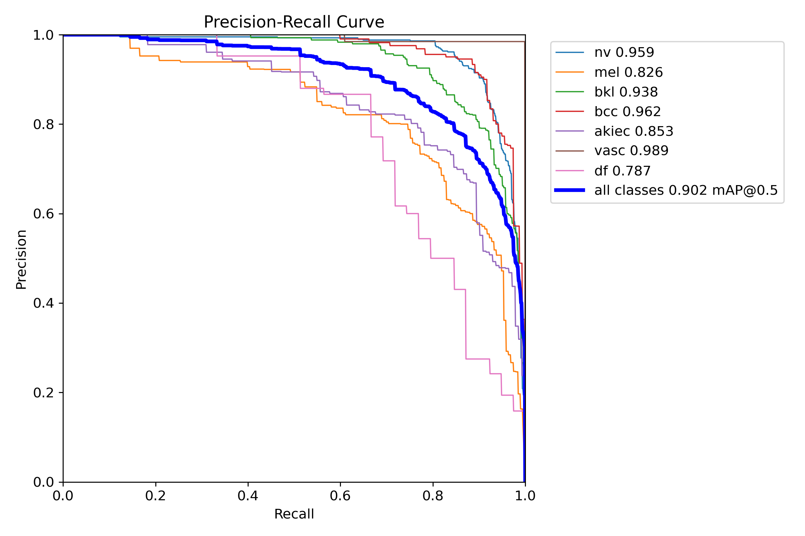
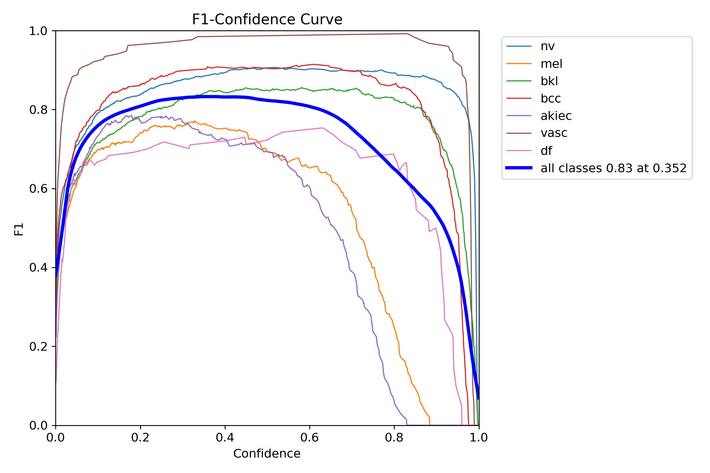
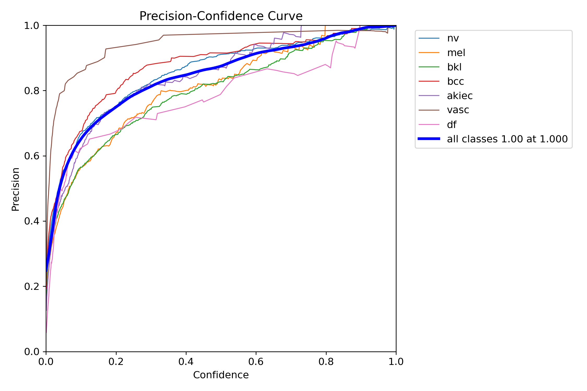
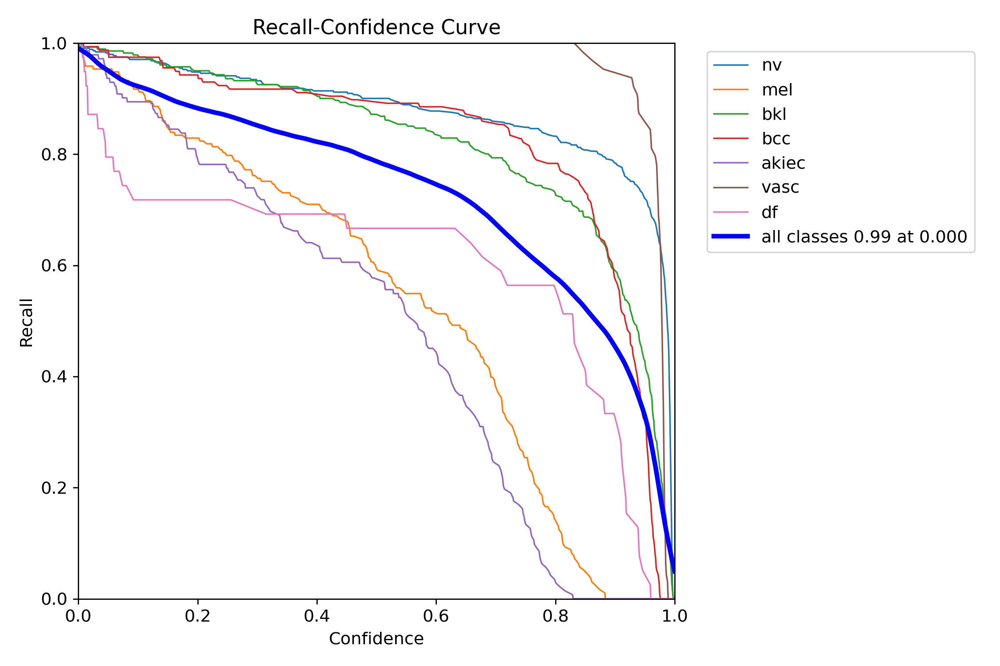
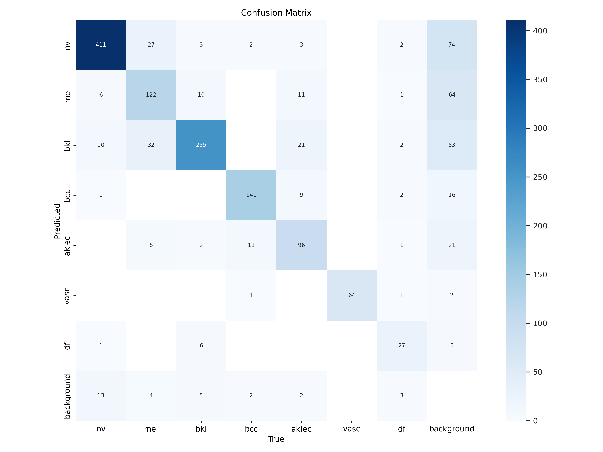
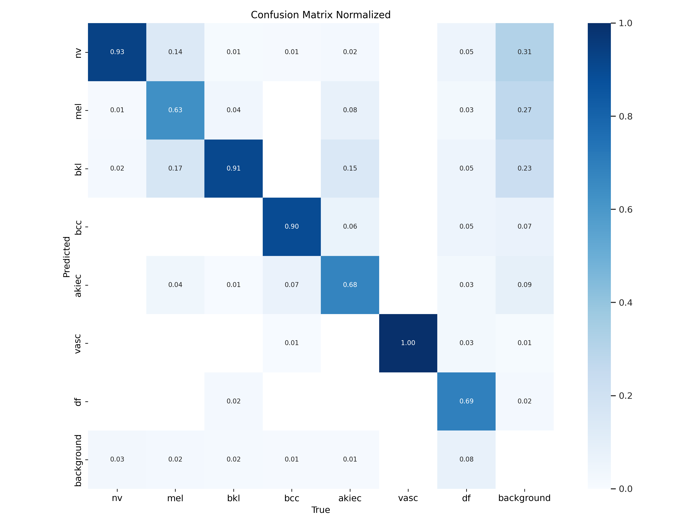
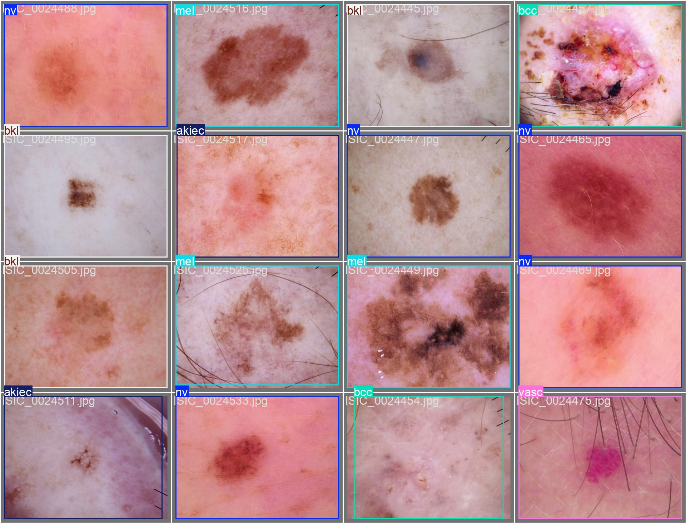
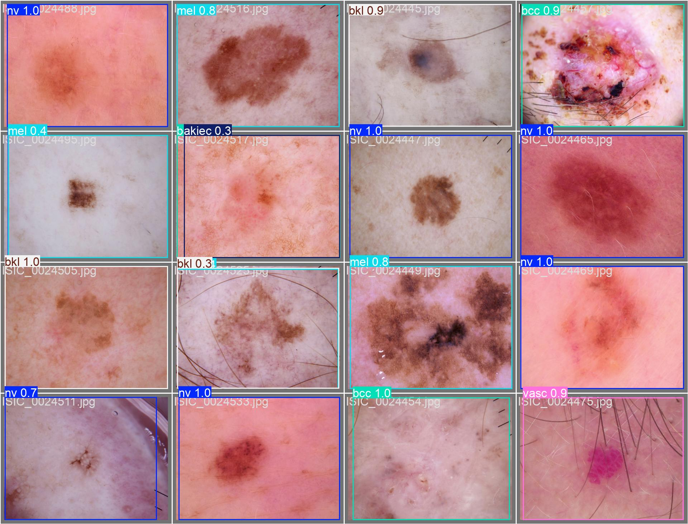

# Результаты [обучения модели](../src/skin_cv/yolo-training.ipynb)

### Metrics

<table>
<tr>
<td> <b> mAP50 (PR-curve): 90.2% </b> </td>

<td> <b> F1-score: 83% at 0.352 </b> </td>
</tr> 
<tr>
<td> </td>

<td> </td>
</tr> 
<tr>
<td> <b> Precision: 100% </b> </td>

<td> <b> Recall: 99% </b> </td>
</tr> 
<tr>
<td> </td>

<td> </td>
</tr> 
</table>

Для сравнения можно обратиться к метрикам [бейзлайна](../src/skin_cv/cancer-baseline.ipynb)

### Confusion Matrix

<table>
<tr>
<td> <b> Original </b> </td>

<td> <b> Normalized </b> </td>
</tr> 
<tr>
<td> </td>

<td> </td>
</tr> 
</table>

### Labels vs Predictions

<table>
<tr>
<td> <b> Labels </b> </td>

<td> <b> Predictions </b> </td>
</tr> 
<tr>
<td> </td>

<td> </td>
</tr> 
</table>